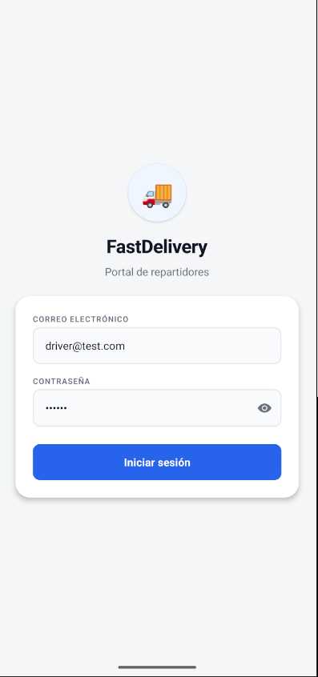
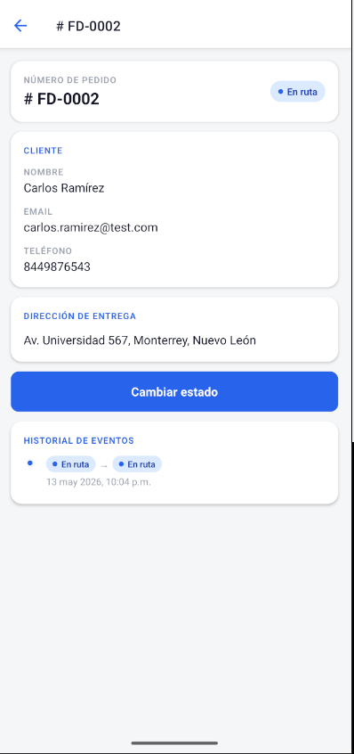

# FastDelivery — Sistema de Gestión de Logística de Última Milla

Proyecto fullstack desarrollado como solución para un reto técnico de logística de última milla.

El sistema permite:

* Autenticación de repartidores.
* Gestión de pedidos.
* Actualización de estados de entrega.
* Registro de trazabilidad y eventos históricos.
* Captura de ubicación GPS.
* Consulta de historial de movimientos.

---

# Arquitectura General

El proyecto utiliza una arquitectura híbrida SQL + NoSQL.

## Backend

Tecnologías:

* NestJS
* TypeScript
* Prisma ORM
* MySQL
* MongoDB
* Mongoose
* JWT
* Swagger

Responsabilidades:

* Autenticación JWT.
* Gestión de pedidos.
* Persistencia relacional.
* Registro de trazabilidad.
* API REST.
* Documentación Swagger.

---

## Frontend Mobile

Tecnologías:

* React Native
* Expo
* Expo Router
* TypeScript
* Axios
* AsyncStorage
* expo-location

Responsabilidades:

* Login de repartidores.
* Visualización de pedidos.
* Detalle de entregas.
* Cambio de estado.
* Captura GPS.
* Consulta de historial.

---

# Estructura del Repositorio

```txt
Sistema-de-Gestion-de-Logistica/
├── README.md
├── swagger.json
├── fastdelivery-api/
│   └── README.md
└── fastdelivery-app/
    └── README.md
```

---

# Base de Datos

## MySQL

Se utiliza para:

* Usuarios
* Clientes
* Pedidos

Modelos principales:

```txt
User
Customer
Order
```

---

## MongoDB

Se utiliza para trazabilidad y eventos históricos.

Colección principal:

```txt
DeliveryEvent
```

Cada evento registra:

* orderId
* previousStatus
* newStatus
* location
* comment
* createdAt

---

# Flujo General

```txt
Mobile App
    ↓
NestJS API
    ↓
Prisma + MySQL
    ↓
MongoDB Events
```

Cuando un pedido cambia de estado:

1. El frontend obtiene ubicación GPS.
2. Se envía PATCH al backend.
3. MySQL actualiza el estado actual.
4. MongoDB registra el evento histórico.
5. El frontend consulta historial actualizado.

---

# Estados de Pedido

```txt
PENDING
ON_ROUTE
DELIVERED
CANCELLED
```

Reglas implementadas:

* PENDING → ON_ROUTE | CANCELLED
* ON_ROUTE → DELIVERED | CANCELLED
* DELIVERED → estado final
* CANCELLED → estado final

No se permiten transiciones inválidas.

---

# Requisitos Previos

## Node.js

Versión recomendada:

```txt
22.13.0 o superior
```

Verificar:

```bash
node -v
npm -v
```

---

## MySQL

Verificar:

```bash
mysql --version
```

---

## MongoDB

Verificar:

```bash
mongosh --version
```

---

## Expo Go

Instalar en dispositivo móvil:

### Android

[https://play.google.com/store/apps/details?id=host.exp.exponent](https://play.google.com/store/apps/details?id=host.exp.exponent)

### iOS

[https://apps.apple.com/app/expo-go/id982107779](https://apps.apple.com/app/expo-go/id982107779)

---

# Instalación General

## Clonar repositorio

```bash
git clone <URL_DEL_REPOSITORIO>
```

Entrar:

```bash
cd Sistema-de-Gestion-de-Logistica
```

---

# Backend

Entrar:

```bash
cd fastdelivery-api
```

Seguir instrucciones detalladas en:

```txt
fastdelivery-api/README.md
```

Incluye:

* variables de entorno
* migraciones Prisma
* MongoDB
* Swagger
* seed
* JWT

---

# Frontend

Entrar:

```bash
cd fastdelivery-app
```

Seguir instrucciones detalladas en:

```txt
fastdelivery-app/README.md
```

Incluye:

* Expo
* navegación
* configuración API
* GPS
* AsyncStorage
* ejecución en dispositivo físico

---

# Swagger

El backend expone documentación interactiva:

```txt
http://localhost:3000/api/docs
```

También se incluye:

```txt
swagger.json
```

como contrato oficial de la API.

---

# Seed de Datos

El backend incluye un seed para generar datos demo automáticamente.

El seed crea:

* Usuario repartidor
* Cliente demo
* Pedido demo

Usuario generado:

```txt
Email: driver@test.com
Password: 123456
```

---

## Ejecutar Seed

Entrar al backend:

```bash
cd fastdelivery-api
```

Ejecutar:

```bash
npx prisma db seed
```

---

## Requisitos

Antes de ejecutar el seed:

* MySQL debe estar corriendo
* MongoDB debe estar corriendo
* Las migraciones Prisma deben haberse ejecutado

Ejecutar migraciones:

```bash
npx prisma migrate dev
```

---

## Datos Generados

El seed genera automáticamente:

### Usuario

```txt
Role: DRIVER
```

### Cliente

```txt
Nombre
Teléfono
Email
Dirección
```

### Pedido

```txt
TrackingId
Estado inicial: PENDING
Asignación a repartidor
```

Esto permite probar inmediatamente:

* Login
* Lista de pedidos
* Detalle
* Cambio de estado
* Historial
* Swagger
* Postman

---

# Usuario Demo

```txt
Email: driver@test.com
Password: 123456
```

---

# Funcionalidades Implementadas

## Backend

* JWT Authentication
* Prisma ORM
* MySQL integration
* MongoDB integration
* Swagger documentation
* Order management
* Delivery events tracking
* Status transition validation
* Seed data
* DTO validation

---

## Frontend

* Login
* JWT persistence
* Orders list
* Order detail
* Change status
* GPS capture
* Timeline history
* Pull to refresh
* Loading states
* Error handling (Interceptores globales)
* Responsive UI
* Detección dinámica de IP para la API

---

# Capturas

## Login



---

## Lista de pedidos


---

## Detalle de pedido



---

# Validación Final

Backend probado:

* Login
* Swagger
* JWT
* Orders endpoints
* MongoDB history
* Status validation

Frontend probado:

* Login
* Persistencia de sesión
* Lista de pedidos
* Detalle
* Cambio de estado
* Captura GPS
* Historial

---

# Consideraciones Técnicas

* Expo Router está construido sobre React Navigation.
* Prisma ORM se utiliza para acceso tipado a MySQL.
* MongoDB almacena eventos históricos flexibles.
* Swagger documenta el contrato completo del backend.
* Axios utiliza interceptores para inyectar el JWT y manejar globalmente los errores (ej. auto-logout y redirección en 401).
* AsyncStorage mantiene persistencia de sesión.
* La app móvil utiliza `expo-constants` para deducir automáticamente la IP local del servidor en desarrollo, evitando IPs hardcodeadas y facilitando la evaluación del reto.
